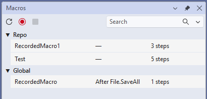

# Macros for Visual Studio

[](https://github.com/MadsKristensen/Macros/actions/workflows/build.yml)
[](https://github.com/MadsKristensen/Macros/releases)
[](LICENSE)

> **Record once. Repeat forever — manually or on cue.**

A modern Visual Studio 2022 extension that brings back the power of recorded automation. Record sequences of text edits and IDE commands, replay them with a single keystroke, or trigger them automatically on build, save, or any IDE event. Every macro is an editable C# script — no black boxes, full IntelliSense.



## Why

- **Stop doing the same 6-step ritual** every time you open a file or start a build.
- **Run a code-format pass** automatically after every successful build.
- **Capture your testing workflow once**; replay it on demand.
- **Intercept and modify commands** before they execute (e.g., block Save during a build).
- **Version-control team automation** — save macros in your repo, shared by the team.

## 30-second wow

1. **Record:** Press **`Ctrl+Shift+R`**, do your thing (type code, run commands), press **`Ctrl+Shift+R`** again to stop.
2. **Replay:** Move your caret and press **`Ctrl+Shift+P`** — your actions replay instantly.
3. **Trigger (optional):** Add `// @trigger Build.SolutionBuildDone` at the top of the macro to fire it automatically.

```c#
// @trigger Build.SolutionBuildDone when success=false
await VS.StatusBar.ShowMessageAsync("💥 Build failed!");
await ExecuteCommandAsync("View.ErrorList");
```

## Install

- **[Visual Studio Marketplace](https://marketplace.visualstudio.com/)** (coming soon)
- **Manual:** Download `Macros.vsix` from [Releases](https://github.com/MadsKristensen/Macros/releases) and double-click to install.

Requires **Visual Studio 2022** (17.10+) on Windows.

## Documentation

- **[Getting Started](docs/getting-started.md)** — 60-second setup, hotkeys, save your first macro.
- **[Recording](docs/recording.md)** — What gets captured, step aggregation, the current slot.
- **[Replaying](docs/replaying.md)** — Play Last, tool window, error handling.
- **[C# Scripting Reference](docs/csx-reference.md)** — Helpers API, MacroGlobals, code examples.
- **[Triggers](docs/triggers.md)** — @trigger directive, all event/command types, filters, examples.
- **[Scopes](docs/scopes.md)** — Global vs Repo macros, storage, team sharing.
- **[Security](docs/security.md)** — Trust gate, auto-disable, why macros are code.
- **[Troubleshooting](docs/troubleshooting.md)** — Common issues and fixes.
- **[Architecture](docs/architecture.md)** — For contributors: how it works under the hood.

## Contributing

Issues, ideas, and PRs welcome on [GitHub](https://github.com/MadsKristensen/Macros).

- **New to the codebase?** See [Building from source](docs/architecture.md#building-from-source).
- **Extending VS?** Check the [Community.VisualStudio.Toolkit](https://github.com/VsixCommunity/Community.VisualStudio.Toolkit) docs.

## License

MIT — see [`LICENSE`](LICENSE). Built by [Mads Kristensen](https://github.com/MadsKristensen) with the excellent [Community.VisualStudio.Toolkit](https://github.com/VsixCommunity/Community.VisualStudio.Toolkit).
